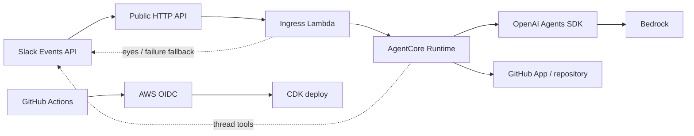

# Slack Codex Agent on AgentCore

A code agent invoked by mentioning `@Codex` in Slack. Each Slack thread maps to
one Amazon Bedrock AgentCore Runtime session, so follow-up mentions reuse the
same OpenAI Agents SDK agent, conversation history, and filesystem for up to
eight hours.



The sample deliberately has no EventBridge, queue, database, API Gateway
authorizer, external conversation store, or custom repository API. It uses:

- Slack request signing to authenticate the public events route.
- An ARM64 AgentCore container with an unrestricted shell and focused file tools.
- OpenAI's Agents SDK with the Bedrock provider and AWS credential chain.
- A GitHub App installation token for repository access and bot identity.
- Repository-scoped GitHub OIDC credentials for deployment after merges to
  `main`.
- CDK for every AWS resource.

See [setup.md](./setup.md) for the complete deployment and app configuration
runbook.

## Start here

The setup order matters because the Slack request URL does not exist until CDK
has deployed the HTTP API:

1. Create the target GitHub repository.
2. Create the GitHub App and install it on that repository.
3. Create the Slack app from `slack-app-manifest.yaml`. Event Subscriptions are
   intentionally absent from the manifest.
4. Run the local unit tests, then deploy the CDK stack.
5. Populate the three Secrets Manager resources created by CDK.
6. Verify AgentCore with stubbed Slack.
7. Enable Slack Event Subscriptions, verify the deployed URL, and add
   `app_mention`.
8. Set the deployment repository variables and let
   `.github/workflows/deploy.yml` deploy future changes to `main`.

Follow [setup.md](./setup.md) rather than enabling Event Subscriptions during
manifest import.

## Request lifecycle

1. Slack sends a signed `app_mention` event to the public HTTP API.
2. Lambda verifies the raw-body HMAC and five-minute replay window.
3. Lambda ignores bot events and Slack retries, adds `:eyes:`, derives a stable
   session ID from the Slack team, channel, and thread, and invokes AgentCore.
4. The runtime returns `accepted` immediately while `@app.async_task` tracks the
   agent turn in the background.
5. The runtime serializes turns with one lock, appends the request to in-memory
   history, and calls `Runner.run()` once. The Agents SDK owns the agentic loop.
6. Slack tools publish the answer and terminal reaction. Runtime fallback
   handling posts an error and red status if the turn crashes or finishes
   silently.

## Runtime model

Lambda derives a stable AgentCore session ID from the Slack team, channel, and
thread. AgentCore gives that session its own microVM. Inside it, the process
creates one Bedrock client, one `Agent`, one lock, and one in-memory Agents SDK
history list.

For every turn, the runtime appends the new request, calls `Runner.run()` with
the complete history, and replaces history with `result.to_input_list()`.
Concurrent mentions in one thread are serialized. No message or tool state is
written to a database.

The `Agent` is reusable configuration, not a mutable conversation container.
Conversation state therefore lives in a module-global history list beside the
single `Agent` instance. The runtime does not rely on provider-side
Conversations or `previous_response_id`.

Both AgentCore lifecycle settings are eight hours. When the microVM expires,
conversation history and `/workspace` disappear. A later mention starts clean,
reads the durable Slack thread, and clones the repository again if needed.

## Slack protocol

Lambda immediately adds `:eyes:` to the triggering mention. Before the model
turn starts, the runtime sets working on both the thread parent and current
trigger. The model then owns waiting and terminal state:

| State | Reaction |
|---|---|
| Working | `:large_yellow_circle:` |
| Waiting for input | `:question:` |
| Complete | `:large_green_circle:` |
| Failed | `:red_circle:` |

`eyes` remains as an acknowledgement. The four status reactions are mutually
exclusive. Every follow-up requires a new `@Codex` mention.

The user only sees Slack tool calls, never assistant text or tool output. The
runtime posts a red fallback reply if the agent crashes or finishes silently.
Identical Slack messages are idempotent within one turn, protecting users from
duplicate model tool calls while leaving provider-default parallel tools
enabled.

## Agent capabilities

Code tools live together in
`runtime/src/slack_codex/tools/code_tools.py`:

- `run_bash`
- `read_file`
- `write_file`
- `edit_file`
- `list_directory`
- `glob_files`
- `grep_search`

Slack tools live together in
`runtime/src/slack_codex/tools/slack_tools.py`:

- `read_thread`
- `reply_to_thread`
- `set_thread_status`
- `ask_user`
- `react_to_message`
- `download_file`
- `upload_file`

Slack identifiers are bound through the invocation context, so the model cannot
select another channel. Dedicated file tools are constrained to `/workspace`.
Shell access is intentionally unrestricted, with command timeouts, process-group
cleanup, and bounded output.

For a code change, the agent clones `$GH_REPO`, creates a `codex/*` branch,
edits and tests the code, commits, pushes, opens a ready pull request, and posts
the URL in Slack. It can inspect pull-request checks and failed GitHub Actions
logs through `gh`, but never pushes to the default branch, force-pushes,
approves, merges, dispatches workflows, or deploys.

## Repository layout

```text
.
|-- infra/
|   |-- bin/                    CDK application
|   |-- functions/              Slack events Lambda
|   |-- lib/                    AgentCore and ingress stack
|   |-- scripts/                Synchronous AgentCore test client
|   `-- test/                   Lambda and CDK assertions
|-- .github/workflows/
|   `-- deploy.yml              OIDC-authenticated CDK deployment
|-- runtime/
|   |-- src/slack_codex/
|   |   |-- tools/              Code and Slack tools
|   |   |-- agent.py            Bedrock-backed Agents SDK agent
|   |   |-- app.py              AgentCore entrypoint
|   |   |-- state.py            Per-microVM state and serialization
|   |   `-- prompt.md           Agent instructions
|   `-- tests/
|-- slack-app-manifest.yaml
`-- setup.md
```

## Test without Slack

The runtime supports a synchronous `source: "test"` payload. It runs in the
real deployed AgentCore microVM and uses the real Bedrock model, Agents SDK
loop, code tools, and `/workspace`; only Slack is replaced by an in-memory
stub.

Run the repeatable end-to-end smoke test:

```bash
cd infra
AGENT_RUNTIME_ARN="arn:aws:bedrock-agentcore:..." npm run test:e2e
```

The command fails unless the model reads the thread, authenticates to the
configured repository through the GitHub App, uses shell and file tools, posts
exactly one Slack reply, and finishes with green status.

For prompt iteration or multi-turn testing, invoke the test endpoint directly:

```bash
cd infra
AWS_PROFILE=slack-agent AWS_REGION=us-east-1 npm run invoke:test -- \
  --runtime-arn AGENT_RUNTIME_ARN \
  --session prompt-dev \
  --prompt "Read the thread, reply with the tools you can use, then mark done."
```

Reuse `--session prompt-dev` to test follow-up context and filesystem reuse.
Choose another name for a clean microVM. Attach a file with
`--attach ./path/to/file`.

The command returns the posted messages, reaction transitions, uploads, full
stub thread, and final status. This is the fastest way to iterate on
`prompt.md` before involving Slack.

Test mode is not a second implementation. It uses the deployed container,
Bedrock model, Agents SDK loop, code tools, in-memory history, and filesystem;
only the Slack client is replaced by an in-memory implementation.

## Development checks

```bash
cd runtime
uv sync --frozen
uv run ruff check .
uv run pytest

cd ../infra
npm ci
npm run build
npm test
npm run synth -- \
  -c githubRepository=OWNER/REPOSITORY \
  -c githubOidcSubject='repo:OWNER/REPOSITORY:ref:refs/heads/main'
```

`npm test` and `pytest` are offline unit/contract tests. `npm run test:e2e` is
the intentionally small live test and incurs AgentCore and model usage.

## Trust boundary

This is a demo for a trusted Slack workspace. Anyone allowed to mention the app
can direct an agent with an unrestricted shell and repository credentials.
The GitHub App should be installed on one repository with only Contents and
Pull requests read/write access. Harden command execution and identity policy
before using this design across untrusted users or sensitive repositories.

## Deliberate limits

- State and files last only for the AgentCore microVM lifetime.
- Every follow-up must mention `@Codex`.
- Slack thread reads are capped at 100 messages and file transfers at 50 MB.
- The ingress route is public and authenticated by Slack signatures, not an API
  Gateway authorizer.
- The shell is unrestricted by design. This sample assumes a trusted workspace
  and a narrowly installed GitHub App.
- GitHub Actions can assume only the repository/main-scoped deployment role,
  which can in turn assume only the regional CDK bootstrap roles.
- Branch protection is not managed by this sample. Protect `main` before
  allowing broader write access to the repository.
