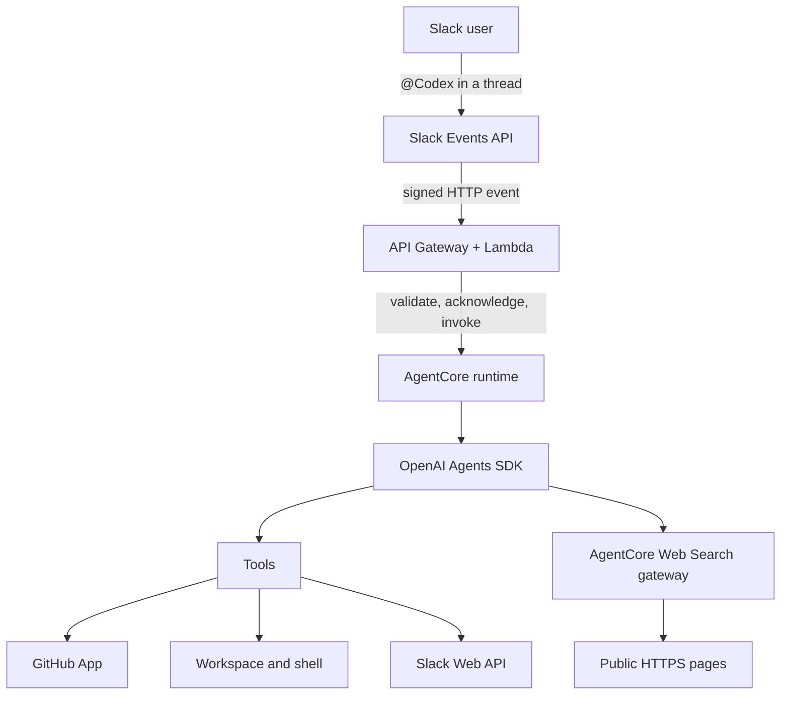

# Slack Codex Agent

A Slack bot that runs a code agent in Amazon Bedrock AgentCore. Mention `@Codex` in a thread to ask it to inspect code, research public documentation, or open a pull request.

## How it works



The ingress validates Slack signatures and acknowledges events quickly. AgentCore keeps a thread session, runs the agent, and posts progress and replies back to Slack. GitHub credentials come from Secrets Manager and are exchanged for short-lived App tokens. The runtime and `/workspace` are ephemeral and last up to eight hours.

## What it includes

- Slack signature verification and thread-based sessions
- OpenAI Agents SDK backed by a Bedrock model
- A GitHub App for short-lived repository credentials
- AgentCore Web Search plus safe HTTPS page fetching
- CDK infrastructure and GitHub Actions deployment through OIDC

The default region is `us-east-1`, where the managed Web Search integration is available. This sample is intended for a trusted Slack workspace: the agent has an unrestricted shell and repository credentials.

## Quick start

Follow [`setup.md`](setup.md) in order. The short version is:

1. Create a GitHub repository and GitHub App; install the App on that repository.
2. Create the Slack app from [`slack-app-manifest.yaml`](slack-app-manifest.yaml). Leave Event Subscriptions disabled.
3. Install dependencies and run the offline checks:

   ```bash
   cd runtime && uv sync --frozen && uv run ruff check . && uv run pytest
   cd ../infra && npm ci && npm run build && npm test
   ```

4. Bootstrap and deploy the CDK stack from `infra/`.
5. Replace the three generated Secrets Manager values with the Slack signing secret, Slack bot token, and GitHub App JSON.
6. Run the AgentCore smoke test, then add the deployed `SlackEventsUrl` as Slack’s Request URL and subscribe to `app_mention`.

## Test a deployment

```bash
cd infra
AGENT_RUNTIME_ARN="arn:aws:bedrock-agentcore:..." npm run test:e2e
AGENT_RUNTIME_ARN="arn:aws:bedrock-agentcore:..." npm run test:e2e:web
```

The first test exercises the agent with stubbed Slack. The second checks managed search and page fetching. Both use the deployed model and may incur AWS charges.

For a manual turn or prompt iteration:

```bash
cd infra
npm run invoke:test -- \
  --runtime-arn "$AGENT_RUNTIME_ARN" \
  --session prompt-dev \
  --prompt "Read the thread, reply with the tools you can use, then mark done."
```

## Development

Runtime checks:

```bash
cd runtime
uv sync --frozen
uv run ruff check .
uv run pytest
```

Infrastructure checks:

```bash
cd infra
npm ci
npm run build
npm test
npm run synth -- \
  -c githubRepository=OWNER/REPOSITORY \
  -c githubOidcSubject='repo:OWNER/REPOSITORY:ref:refs/heads/main'
```

## Repository layout

```text
infra/                 CDK stack, Lambda, tests, and test client
runtime/               AgentCore image, tools, prompt, and tests
.github/workflows/     CI and OIDC deployment
slack-app-manifest.yaml
setup.md               Deployment runbook
```

## Important limits

- Session history and `/workspace` last only while the AgentCore microVM is alive (up to eight hours).
- Follow-ups must mention `@Codex` in the same Slack thread.
- Web fetching supports public HTTPS server-rendered text only; it does not run JavaScript.
- The ingress endpoint is public but accepts only valid Slack-signed requests.
- Review pull requests and harden shell and identity controls before using this design with untrusted users.
